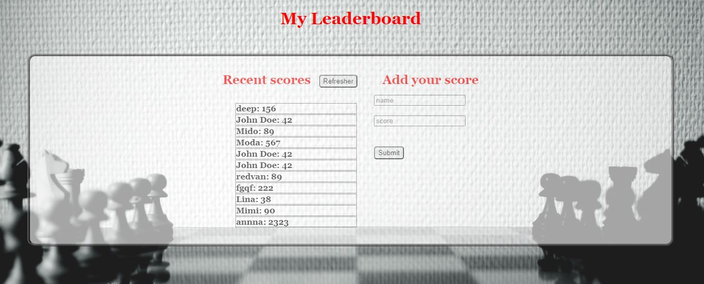

# Project Name

> This is a Leaderboard list app, setup using webpack and ES6 modules.




## Built With

- JavaScript
- HTML
- CSS
- Webpack

## Live Demo

[Live Demo Link](https://algerina.github.io/Leaderboard/dist/)


## Getting Started

**This is an example of how you may give instructions on setting up your project locally.**
**Modify this file to match your project, remove sections that don't apply. For example: delete the testing section if the currect project doesn't require testing.**


To get a local copy up and running follow these simple example steps.

### Prerequisites
Web browser (Google Chrome, Firefox, Safari)

### Setup
Git clone https://github.com/algerina/Leaderboard.git

### Usage
Run the commands `npm install` followed by `npm run start`

### Run tests
cd into the cloned folder and run 
```bash
npm install
npm run linters
```
## Authors

👤 **Amel Khiri**

- GitHub: [@Algerina](https://github.com/Algerina)
- LinkedIn: [Amel Khiri](https://linkedin.com/in/amel-khiri-qahwadji-37a550135)


## 🤝 Contributing

Contributions, issues, and feature requests are welcome!

Feel free to check the [issues page](../../issues/).

## Show your support

Give a ⭐️ if you like this project!

## Acknowledgments

- Hat tip to anyone whose code was used
- Inspiration
- etc

## 📝 License

This project is [MIT](./MIT.md) licensed.
